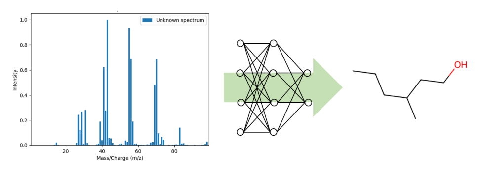

# MASSISTANT

## What is MASSISTANT?

MASSISTANT is a tool for predicting de novo SELFIES representation of a molecule from its EI mass spectrum. Developed by Lazar Barta at Envalior Materials as part of a master internship at Maastricht University. 

**Disclaimer**: The models were trained on the commercial NIST EI mass spectra dataset and is not provided. You can find an example of the required format in the `Dataset` folder.

## Approach
The models are trained on EI mass spectra and the encoded SELFIES representation of the corresponding molecule. No matter how SELFIES parts are put together, it will always result in a valid molecule. Using this property of SELFIES, the model predicts SELFIES parts from a mass spectrum. These SELFIES parts together will provide the predicted molecule.

## Train your own model
1) Import your dataset in the `Dataset` folder.
2) Use `Code/dataset_cleaning.py` to clean your dataset. It will create the `.csv` files which will be necessary to train your models. Before running it, update the path to your dataset in the script.
3) Encode the SELFIES representation of your dataset using `Code/Full_systems/Selfies_Mol/Featurization/selfies_featurization_one_hot.ipynb`. A one-hot encoding of the SELFIES representation is necessary to train the models. This notebook will also generate the train and test data for the model.
4) To train your models, use `Code/Full_systems/Selfies_Mol/Multitask_Classifier/SELFIES_multitask_tuner.ipynb`. This notebook will train the model and save it in the `Models` folder.

## Predict SELFIES representation from mass spectra
Will be available soon.

## Files in this folder
`.env` contains environment variables for the project. You can modify the variables to your needs, but it is not necessary. Only adjust them when you are familiar with the project structure and the functioning of the code.
`.rootfloder` is a marker file to indicate the root folder of the project. It is used by the scripts to navigate to the root folder of the project. **Do not delete this file.**

## Find out more
Read our publication MASSISTANT: A Deep Learning Model for De Novo Molecular Structure Prediction from EI‑MS Spectra via SELFIES Encoding at this [link](https://chemrxiv.org/engage/chemrxiv/article-details/67d9484d6dde43c9083d4dde).

## Docker image
A Docker image containing the environment and the files will be available soon.

## Quote
J. Mommers, L. Barta, M. Pietrasik, and A. Wilbik, “MASSISTANT: A Deep Learning Model for De Novo Molecular Structure Prediction from EI‑MS Spectra via SELFIES Encoding,” Mar. 19, 2025, ChemRxiv. doi: 10.26434/chemrxiv-2025-qchjl.

## Contact
[Lazar Barta](mailto:ld.barta@student.maastrichtuniversity.nl), 
[John Mommers](mailto:john.mommers@Envalior.com)